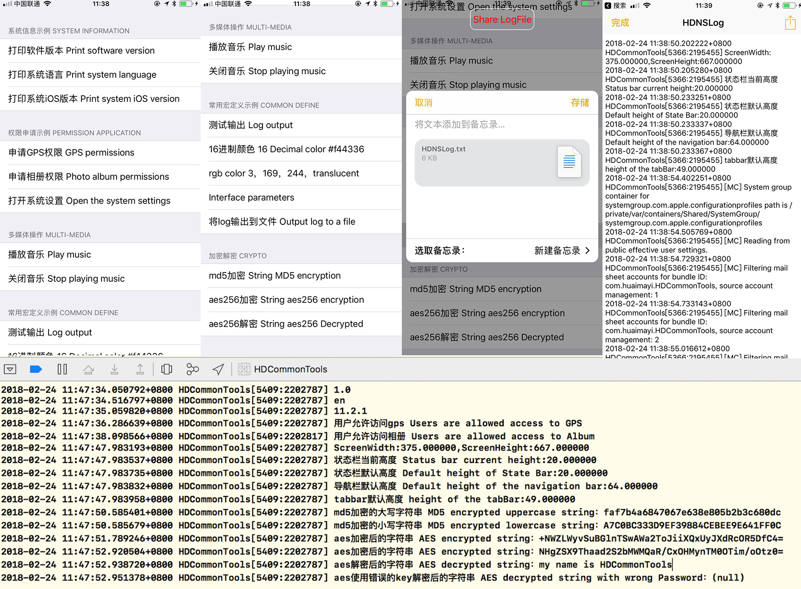

# HDCommonTools

一句代码即可实现多种常用功能，根据数据处理、文件管理、多媒体管理、权限管理、系统信息、Appstore操作、加密解密、快捷宏定义等几种不同的类型封装不同的Category，同时可以通过调用不同的函数去使用。

A short code can achieve a variety of commonly used functions, according to the data processing, file management, multimedia management, rights management, information system, Appstore, encryption and decryption, quick macro definition type package several different Category.

## 一、导入项目 Import project

该工具可以使用cocoapods导入，也可以通过下载源文件导入。

The HDCommonTools can be imported with cocoapods or by downloading source files.

### 通过cocoapods导入 Importing through cocoapods

```
pod 'HDCommonTools'
```
### 通过文件导入 Importing through files

下载项目，将项目文件下的HDCommonTools文件夹里面的内容导入项目即可

Download the project, import the contents of the HDCommonTools folder into the project.

## 二、函数使用 Function use

两步即可调用所有函数功能。

All function functions can be called in the two step.

### 1、导入头文件 Import header file

```
#import "HDCommonHeader.h"
```
### 2、通过单例调用即可 Can be called by a single case
```
///获取手机的语言设置
[[HDCommonTools sharedHDCommonTools] getIOSLanguage];
///申请gps权限
[[HDCommonTools sharedHDCommonTools] getGPSLibraryWithType:kHDGPSPermissionWhenInUse];
...
```
### 3、权限通知说明 Permission notice

在申请权限的过程，在返回结果的时候会触发通知

In the process of applying for permissions, a notification is triggered when the result is returned.

```
///系统权限授权变化通知
//System authority authorization change notification
FOUNDATION_EXPORT NSString * const HDPermissionStatusDidChangeNotification;

///系统变化通知中的userinfo的key，标记名字
//The key of the userinfo in the system change notification, marked name
FOUNDATION_EXPORT NSString * const HDPermissionNameItem;

///系统变化通知中的userinfo的key，标记状态
//The key of userinfo in the system change notification, marked state
FOUNDATION_EXPORT NSString * const HDPermissionStatusItem;
```

以申请gps权限为例

Take the application of GPS authority as an example

```
- (void)viewDidLoad {
    [super viewDidLoad];
    ///注册权限回调通知 egistration authority callback notice
    [[NSNotificationCenter defaultCenter] addObserver:self selector:@selector(permissionNotifacation:) name:HDPermissionStatusDidChangeNotification object:nil];
    ///申请gps权限 access to GPS
    [[HDCommonTools sharedHDCommonTools] getGPSLibraryWithType:kHDGPSPermissionWhenInUse];
}

-(void)permissionNotifacation:(NSNotification*)notification{
    NSDictionary * userInfo = [notification userInfo];
    if ([[userInfo objectForKey:HDPermissionNameItem] integerValue] == kHDPermissionNameGPS) {
       if ([[userInfo objectForKey:HDPermissionStatusItem] integerValue] == kHDAuthorized) {
            NSLog(@"用户允许访问gps Users are allowed access to GPS");
        }else if ([[userInfo objectForKey:HDPermissionStatusItem] integerValue] == kHDAuthorRestricted){
            NSLog(@"用户被限制访问gps Users are restricted to access to GPS");
        }else if ([[userInfo objectForKey:HDPermissionStatusItem] integerValue] == kHDNotDetermined){
            NSLog(@"用户尚未选择是否允许访问gps User has not chosen to allow access to the GPS");
        }else{
            NSLog(@"用户不允许访问gps Users do not allow access to GPS");
        }
    }
}
```

为了更加清晰的使用，完善了demo，demo中每一类用法都加了使用方法。

For clearer use, demo is perfected, and every usage in demo is used.



## 三、文件结构 file structure

|文件名 file name|文件作用 Document function|
|----|----|
|HDCommonHeader.h|包含所有头文件 Contain all the header files|
|HDCommonDefine.h|快捷处理的宏定义 Macro definition of shortcut processing|
|HDCommonToolsConfig|项目定义的枚举类型 Enumerated type of project definition|
|HDCommonTools|数据处理函数 Data processing function|
|HDCommonTools+FileHandle|文件处理函数 File processing function|
|HDCommonTools+Multimedia|多媒体文件处理函数 Multimedia file processing function|
|HDCommonTools+Permission|权限管理和申请函数 Authority management and application function|
|HDCommonTools+SystemInfo|手机系统信息及项目信息函数 system information and project information function|
|HDCommonTools+Appstore|appstore相关操作函数 Appstore related operating function|
|HDCommonTools+Encrypt|加密解密相关操作函数 Encryption and decryption related operating function|

## 四、功能概述 An overview of the function

```
#pragma mark -
#pragma mark - 数据处理类
/**
 将log打印信息输出到文件中，调用此函数后控制台将不再显示log的打印信息
 @return 返回打印信息所在的文件路径
 The log print information is exported to the file, and the console will no longer display the print information of the log after calling this function
 Returns the path of the file where the print information is located
 */
+(NSString*)setHdDebugLogToFile;

/// 将字典或者数组转化为Data数据
//Translate dictionaries or arrays into Data
- (NSData *)toJSONData:(id)theData;

/// 将字典或者数组转化为json字符串数据
//Translate dictionaries or arrays into JSON string data
- (NSString *)toJSONStr:(id)theData;

/// 将JSON Data串转化为字典或者数组
//Converting the JSON string Data into a dictionary or array
- (id)DataToArrayOrNSDictionary:(NSData *)jsonData;

/// 将JSON串转化为字典或者数组
//Converting the JSON string into a dictionary or array
- (id)StrToArrayOrNSDictionary:(NSString *)jsonStr;

///NSArray转为NSString
//Converting NSArray into NSString
- (NSString*)ArrayToString:(NSArray*)array;

///NSString通过指定的分割符转为NSArray，如果symbol为空，则默认为","
//NSString turns to NSArray by the specified division, and if symbol is empty, the default is ","
- (NSArray*)StringToArray:(NSString*)str bySymbol:(NSString*)symbol;

///unicode转换为中文
//Unicode conversion to Chinese
- (NSString*)convertUnicodeString:(NSString*)unicodeStr;

///从指定文件名文件获取json内容
//Getting the JSON content from the specified file name file
- (id)getJsonDataFromFileName:(NSString*)jsonName;

///获取当前时间的时间戳
//Get the timestamp of the current time
- (NSString*)getCurrentTimeStamp;

///获取指定时间的时间戳
//Get the timestamp of the specified time
- (NSString*)getTimeStampByDate:(NSDate*)date;

/**
 时间戳获取时间
 Getting time through a timestamp
 
 @param timeStamp 时间戳
 @param quickType 快速格式化时间，如果传None则自己定义foramatter。
 Fast formatting time, if you pass None, you define foramatter
 @param formatter 自己定义foramatter
 you define foramatter
 @return 格式化过的时间
 */
- (NSString*)getTimeFromTimeStamp:(NSString*)timeStamp andQuickFormatType:(HDQuickFormatType)quickType orCustomFormatter:(NSDateFormatter*)formatter;

#pragma mark -
#pragma mark - 文件处理管理类

///将Data内容写入本地保存，重新命名，返回保存过的路径
// Write the Data content to local save, rename, and return the saved path
- (NSString*)savedPathWithData:(NSData*)data WithFileName:(NSString*)fileName;

///在Document创建子文件夹
//Create a subfolder in Document
-(NSString*)createFolder:(NSString*)folderName;

///检查文件夹下是否有指定文件名文件
//Check if there is a specified file name file under the folder
-(BOOL)isExistFileWithName:(NSString*)fileName InFolder:(NSString*)folderName;

#pragma mark -
#pragma mark - 图像视频处理类

///将UIImage内容写入本地保存，重新命名，返回保存过的路径
//Write the UIImage content to local save, rename, and return the saved path
- (NSString*)savedImagePathWithUIImage:(id)img WithFileName:(NSString*)fileName;

///压缩一张图片并返回
//Compress a picture and return
- (UIImage*)compressImage:(UIImage*)img WithQuality:(float)quality;

///图片压缩数组，返回压缩过的图片数组
//The picture compresses the array, returns the compressed array of pictures
- (NSArray*)compressImageArray:(NSArray*)imgArray WithQuality:(float)quality;


/**
 从视频中截取某一帧  Intercept a frame from the video
 @param videoPath 视频的本地地址 The local address of the video
 @param atTime 截取第几秒的一帧  Intercepting a frame of a second
 @return 返回截图 Return screenshot
 */
- (UIImage*)getVideoPreViewImageFromVideoPath:(NSString*)videoPath withAtTime:(float)atTime;

///获取本地视频的时长
//Get the length of the local video
- (NSUInteger)durationWithVideo:(NSString *)videoPath;

///获取视频的分辨率
//Obtaining the resolution of video
- (CGSize)sizeOfVideo:(AVAsset*)videoAsset;

///播放音效，是否震动
//Play sound effects, set up vibration
- (void)playEffect:(NSString*)effectName andShake:(BOOL)shouldShake;

/**
 播放音乐 Play music
 @param musicPath 音乐的地址 The address of the music
 */
-(void)playMusic:(NSString*)musicPath;
//停止音乐播放 Stop playing music
-(void)stopMusic;

#pragma mark -
#pragma mark - 权限类
///是否有麦克风权限
//Whether have the microphone permissions
- (HDPrivatePermissionStatus)hasAVMediaTypeAudio;

///是否有拍照权限
//Whether have the Camera permissions
- (HDPrivatePermissionStatus)hasAVMediaTypeVideo;

///是否有相册权限
////Whether have the Photo album permissions
- (HDPrivatePermissionStatus)hasPhotoLibrary;

///是否有定位权限
//Whether have the GPS permissions
- (HDPrivatePermissionStatus)hasGPSLibrary;

///申请定位权限
//Apply the GPS permissions
-(void)getGPSLibraryWithType:(HDGPSPermissionType)GPSPermissionType;

///申请麦克风权限
//Apply the Microphone permissions
- (void)getAVMediaTypeAudio;

///申请拍照权限
//Apply the Camera permissions
-(void)getAVMediaTypeVideo;

///申请相册权限
//Apply the Photo album permissions
- (void)getPhotoLibrary;

///打开系统设置
//Open the system settings
- (void)openSetting;

#pragma mark -
#pragma mark - 系统信息类
///软件版本
//the AppVersion
- (NSString*)getAppVersion;

///工程的build版本
//The build version of the project
- (NSString*)getAppBuildVersion;

///系统的ios版本
//The IOS version of the system
- (NSString*)getIOSVersion;

///获取系统语言
//Get the system language
- (NSString*)getIOSLanguage;

///是否是英文语言环境
//Is it an English language environment
- (BOOL)isEnglishLanguage;

///返回系统使用语言
//Return to the system usage language
- (HDSystemLanguage)getLanguage;

///软件Bundle Identifier
//Software Bundle Identifier
- (NSString*)getBundleIdentifier;

///模拟软件唯一标示，如果idfa可用使用idfa，否则则使用模拟的idfa
//The only indication of the simulation software.If IDFA is available, it will return to IDFA.Otherwise, use the analog IDFA
- (NSString*)getIphoneIdfa;

///获取具体的手机型号字符串
//Get a specific handset model string
- (NSString*)getDetailModel;

///是否是平板
//Whether is ipad
- (BOOL)isPad;

///是否是iphoneX
//Whether is iphoneX
-(BOOL)isPhoneX;

#pragma mark -
#pragma mark - Appstore相关操作类

/**
 打开appstore的预览下载页面。 Open the preview download page of Appstore
 @param appleID 指定软件的appid，在itunes后台可以看到。 The appid of the specified software can be seen in the iTunes background
 @param jumpStoreType 跳转到appstore样式类型。 Jump to Appstore style type
 */
-(void)jumpStoreWithAppleID:(NSString*)appleID withType:(HDJumpStoreType)jumpStoreType;

/**
 好评弹窗 High praise window
 @param appleID 评分的appid，在itunes后台可以看到。 The appid of the specified software can be seen in the iTunes background
 如果选择了kHDScoreTypeInApp，或者kHDScoreTypeAuto在10.3版本情况下，appldid无效，自动弹出就是自己app的评分
 @param scoreType 评分样式类型。 Jump to Appstore style type
 */
-(void)giveScoreWithAppleID:(NSString*)appleID withType:(HDScoreType)scoreType;

#pragma mark -
#pragma mark - 加密解密相关操作类

/**
 字符串MD5加密 String MD5 encryption
 @param str 要加密的字符串 String to be encrypted
 @param lowercase 是否小写 Is it a lowercase
 @return 加密过的字符串 Encrypted string
 */
- (NSString*)getMD5withStr:(NSString*)str lowercase:(BOOL)lowercase;


/**
 字符串aes256加密  String aes256 encryption
 @param plain 要加密的字符串 String to be encrypted
 @param key 加密的key值 Encrypted key values
 @return 加密后的字符串 Encrypted string
 */
- (NSString *)AES256EncryptWithPlainText:(NSString *)plain andKey:(NSString*)key;


/**
 字符串aes256解密

 @param ciphertexts 要解密的字符串 String aes256 Decrypted
 @param key 加密的key值 Encrypted key values
 @return 解密后的字符串 Decrypted string
 */
- (NSString *)AES256DecryptWithCiphertext:(NSString *)ciphertexts andKey:(NSString*)key;

#pragma mark -
#pragma mark - 对象引用 Object reference
///弱引用 Weak reference
#define HDWEAKSELF __weak typeof(self) weakSelf = self
///强引用 Strong reference
#define HDSTRONGSELF __strong typeof(weakSelf) strongSelf = weakSelf

#pragma mark -
#pragma mark - log输出
#define HDDEBUG_MODE true
#if HDDEBUG_MODE
#define HDDebugLog( s, ... ) NSLog( @"\n↓↓↓↓↓↓↓↓\n<%p %@:(%d)> \n%s\n%@\n↑↑↑↑↑↑↑↑", __FILE__, [[NSString stringWithUTF8String:__FILE__] lastPathComponent], __LINE__, __FUNCTION__, [NSString stringWithFormat:(s), ##__VA_ARGS__] )
#else
#define HDDebugLog( s, ... )
#endif

#pragma mark -
#pragma mark - 界面 Interface
/*
 *  UIColor
 */
///16进制颜色转为UIColor
///16 Decimal color turn to UIColor
#define HDColorFromRGB(rgbValue) [UIColor colorWithRed:((float)((rgbValue & 0xFF0000) >> 16))/255.0 green:((float)((rgbValue & 0xFF00) >> 8))/255.0 blue:((float)(rgbValue & 0xFF))/255.0 alpha:1.0]
///16进制颜色转为UIColor，设置透明度
///16 Decimal color turn to UIColor with alpha
#define HDColorFromRGBA(rgbValue, _A) [UIColor colorWithRed:((float)((rgbValue & 0xFF0000) >> 16))/255.0 green:((float)((rgbValue & 0xFF00) >> 8))/255.0 blue:((float)(rgbValue & 0xFF))/255.0 alpha:_A]
///通过数值转为UIColor
///Turn to UIColor by numerical value
#define HDColorWithRGB(_R,_G,_B)        ((UIColor *)[UIColor colorWithRed:_R/255.0 green:_G/255.0 blue:_B/255.0 alpha:1.0])
///通过数值转为UIColor，设置透明度
///Turn to UIColor by numerical value with alpha
#define HDColorWithRGBA(_R,_G,_B,_A)    ((UIColor *)[UIColor colorWithRed:_R/255.0 green:_G/255.0 blue:_B/255.0 alpha:_A])
/*
 *  Screen size
 */
//屏幕宽度
//ScreenWidth
#define HDScreenWidth   [UIScreen mainScreen].bounds.size.width
//屏幕高度
//ScreenHeight
#define HDScreenHeight  [UIScreen mainScreen].bounds.size.height
//状态栏当前高度
//Status bar current height
#define HD_Portrait_Status_Height [UIApplication sharedApplication].statusBarFrame.size.height //状态栏高度

// 判断是否是iPhone X
//Judge whether it is iPhone X
#define iPhoneX ([UIScreen instancesRespondToSelector:@selector(currentMode)] ? CGSizeEqualToSize(CGSizeMake(1125, 2436), [[UIScreen mainScreen] currentMode].size) : NO)
// 状态栏默认高度
//Default height of State Bar
#define HD_Default_Portrait_Status_Height (iPhoneX ? 44.f : 20.f)
// 导航栏默认高度
//Default height of the navigation bar
#define HD_Default_Portrait_NAVIGATION_BAR_HEIGHT (iPhoneX ? 88.f : 64.f)
// tabBar默认高度
//Default height of the tabBar
#define HD_Default_Portrait_TAB_BAR_HEIGHT (iPhoneX ? (49.f+34.f) : 49.f)
// home indicator
#define HD_Default_Portrait_HOME_INDICATOR_HEIGHT (iPhoneX ? 34.f : 0.f)


```
## 五、其他 Other

欢迎交流，互相学习

Welcome to exchange and learn from each other

项目gitHub地址：[https://github.com/DamonHu/HDCommonTools](https://github.com/DamonHu/HDCommonTools)

gitHub Url：[https://github.com/DamonHu/HDCommonTools](https://github.com/DamonHu/HDCommonTools)

我的博客：[http://www.hudongdong.com/ios/796.html](http://www.hudongdong.com/ios/796.html)

My Blog：[http://www.hudongdong.com/ios/796.html](http://www.hudongdong.com/ios/796.html)

## 六、重要修改记录 Important revision record

### v1.2.0
1. 增加aes256加密解密模块 Adding aes256 encryption and decryption module
2. 整理MD5加密解密功能 Sorting the encryption and decryption functions of MD5
3. 完善demo示例和说明 Perfect the demo examples and instructions

### v1.1.2
1. 增加常用宏定义 Adding commonly used macro definitions
2. 完善demo示例 Perfect the demo examples

### v1.1.1
1. 增加了appstore的预览页面和评分 Add the preview page and score of Appstore